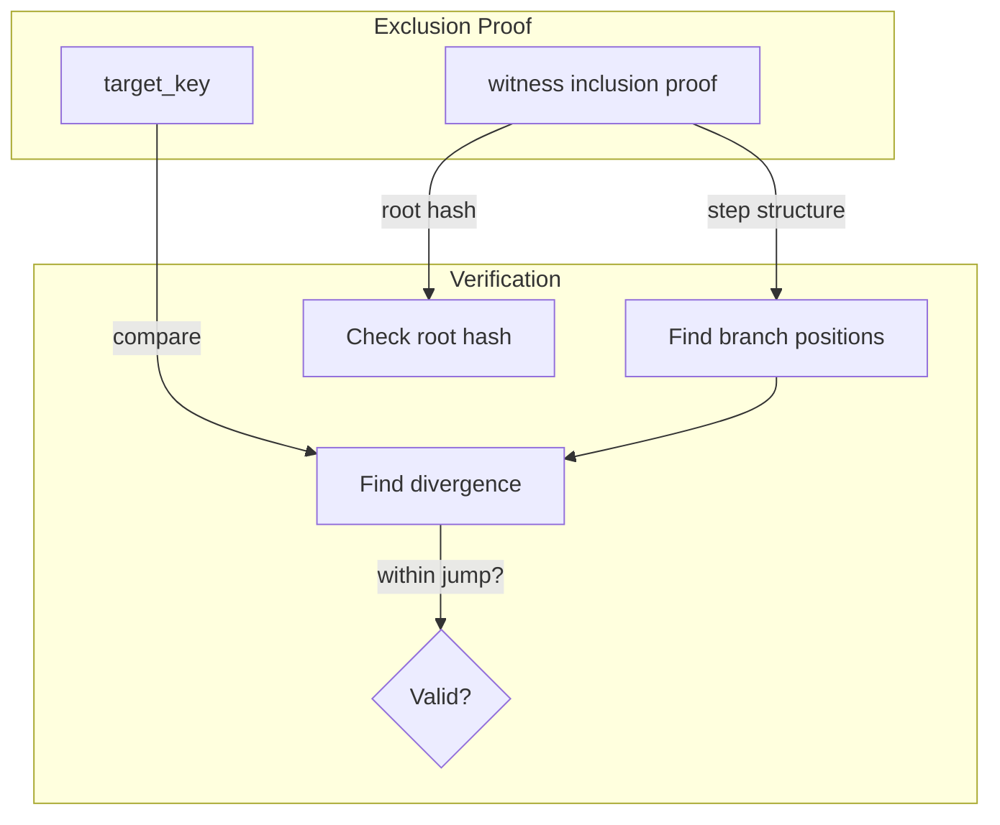

# Exclusion Proof Format

!!! note
    This page describes the **CSMT** exclusion proof format.
    See [Inclusion Proof](inclusion-proof.md) for the inclusion
    proof format, which exclusion proofs build upon.

Exclusion proofs allow verifying that a key does **not** exist
in a CSMT without access to the full tree. They work by
embedding an inclusion proof for a **witness** key whose path
through the tree diverges from the target key within a jump
(path compression region).

## Overview

A CSMT with path compression stores `Indirect { jump, value }`
at each node. A "jump" skips over tree positions where no
branching exists. If a target key's path diverges from the
tree within a jump, there is no branch for the target key to
take — proving it cannot exist.

The proof has two variants:

- **ExclusionEmpty**: the tree is empty, so any key is absent
- **ExclusionWitness**: a witness inclusion proof whose path
  diverges from the target key within a jump



## CDDL Specification

```cddl
--8<-- "docs/architecture/exclusion-proof.cddl"
```

## Data Types

### ExclusionProof

Two variants:

| Variant | Fields | Description |
|---------|--------|-------------|
| `ExclusionEmpty` | none | Tree is empty |
| `ExclusionWitness` | `targetKey`, `witnessProof` | Witness diverges from target |

```haskell
data ExclusionProof a
    = ExclusionEmpty
    | ExclusionWitness
        { epTargetKey :: Key
        , epWitnessProof :: InclusionProof a
        }
```

The `witnessProof` is a standard inclusion proof (same type as
for inclusion verification). It authenticates the tree structure
from root to the witness leaf.

## Verification Algorithm

For `ExclusionEmpty`: trivially valid (caller must verify the
root is actually empty).

For `ExclusionWitness`:

1. **Verify root hash**: compute root hash from the witness
   inclusion proof and compare against the trusted root hash.
   Same algorithm as inclusion proof verification.

2. **Find divergence**: compare `targetKey` against the witness
   key (`witnessProof.proofKey`) bit by bit. Find the first
   position where they differ.

3. **Check divergence is within a jump**: the proof step
   structure defines which positions are branch boundaries and
   which are within jumps:

    - Position `len(rootJump)` is the first branch boundary
    - Position `len(rootJump) + stepConsumed[0]` is the next
    - Position `len(rootJump) + stepConsumed[0] + stepConsumed[1]` is the next
    - etc.

    Everything between consecutive branch boundaries is within a
    jump. Divergence at a branch boundary is **invalid** (the
    target key could exist on the other side of the branch).

```
verifyExclusionProof(trustedRootHash, proof):
    // Step 1: root hash
    computed = computeRootHash(proof.witnessProof)
    if computed != trustedRootHash:
        return false

    // Step 2: find divergence
    divPos = firstDivergence(proof.targetKey,
                             proof.witnessProof.proofKey)
    if divPos is null:
        return false  // keys identical = key exists

    // Step 3: check branch positions
    branchPositions = scanBranchPositions(
        len(proof.witnessProof.proofRootJump),
        [step.stepConsumed for step in proofSteps])
    return divPos not in branchPositions
```

## Example

Consider a tree with keys `[L,L,L]`, `[L,L,R]`, `[R,R,R]`.
We want to prove `[L,R,L]` is absent.

```
Tree structure:
    Root (jump=[])
     / \
    L   R (jump=[R,R] → leaf RRR)
    |
  Node (jump=[L])    ← jump skips to [L,L]
    / \
   L   R
   |   |
  LLL  LLR
```

Target `[L,R,L]` takes direction L at root, then hits the
jump `[L]`. Target needs `R` at that position but the jump
says `L`. Divergence at position 1, which is within the jump
(not at a branch). The tree has no branching at position 1 —
so `[L,R,L]` cannot exist.

Witness key: `[L,L,L]` (any leaf reachable from the
divergence point).

```
ExclusionWitness {
    targetKey = [L, R, L],
    witnessProof = InclusionProof {
        proofKey = [L, L, L],
        proofRootJump = [],
        proofSteps = [
            ProofStep { stepConsumed = 2, ... },
            ProofStep { stepConsumed = 1, ... }
        ],
        ...
    }
}
```

Branch positions: `[0, 2]` (at `rootJumpLen=0` and
`0 + stepConsumed[0]=2`).

Divergence at position 1. Position 1 is NOT a branch → valid
exclusion.

## Security Considerations

Same as inclusion proofs: the verifier must independently
obtain a trusted root hash. The exclusion proof only demonstrates
that the target key is absent from the tree authenticated by
that root hash.

A tampered target key (e.g., swapping with a key that exists)
will fail verification because the divergence point will land
on a branch boundary or the keys won't diverge at all.
