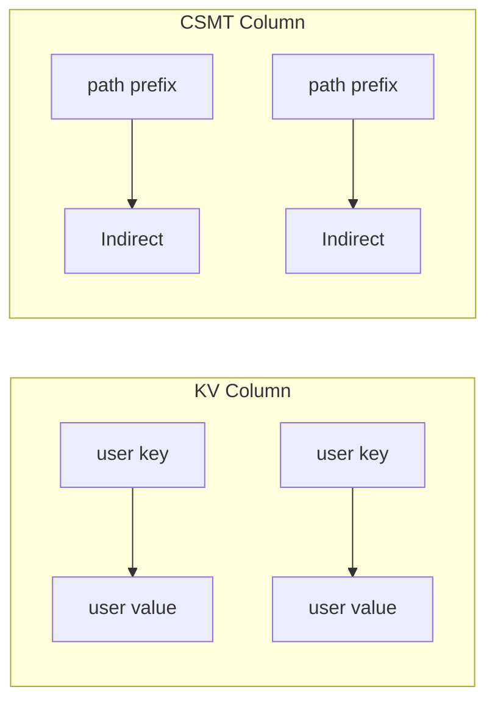
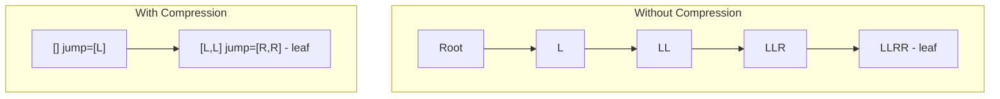
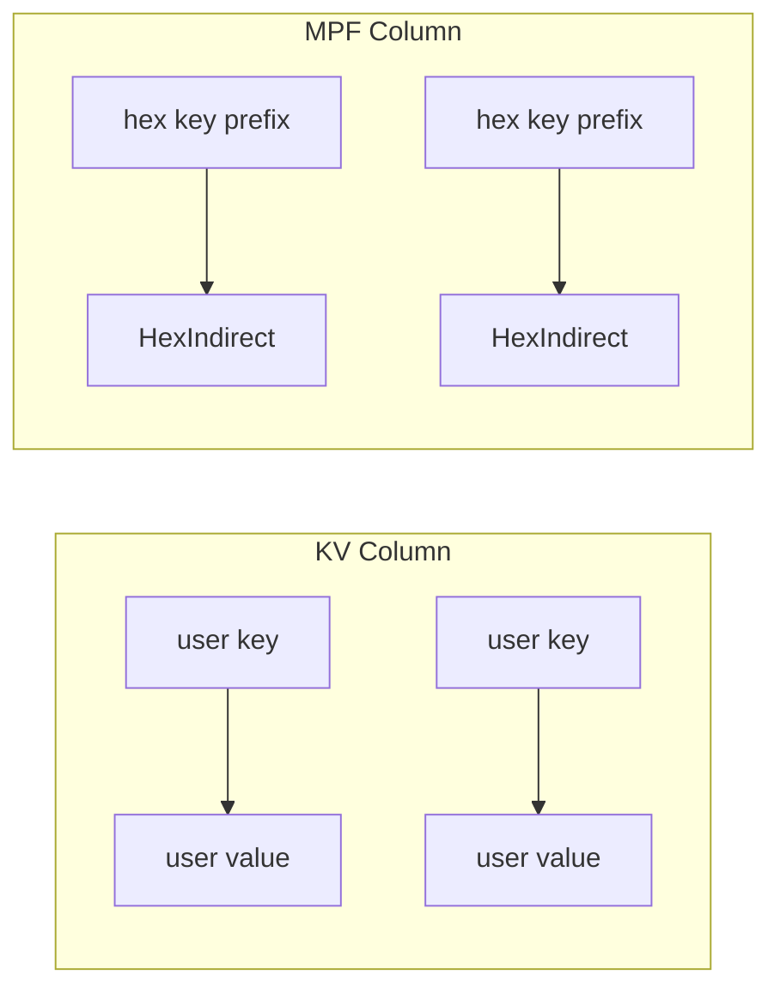

# Storage Layer

Both MTS implementations use a dual-column storage model with RocksDB as
the persistent backend and in-memory backends for testing.

## Shared Model

Both CSMT and MPF store data in two columns:

| Column | Key | Value | Purpose |
|--------|-----|-------|---------|
| KV | User key (`k`) | User value (`v`) | Original key-value pairs |
| Trie | Derived tree key | Node reference | Merkle tree structure |

The KV column stores original key-value pairs, enabling value retrieval
and proof generation. The trie column stores the Merkle tree structure
with implementation-specific node types.

---

## CSMT Storage

### Column Families



| Column | Key Type | Value Type |
|--------|----------|------------|
| KV | User key (`k`) | User value (`v`) |
| CSMT | `treePrefix(v) <> fromK(k)` | `Indirect a` |

The CSMT column key is computed by prepending `treePrefix(value)` to
`fromK(key)`. When `treePrefix = const []` (the default), this is just
`fromK(key)`. A non-trivial `treePrefix` groups entries with the same
prefix into a common subtree, enabling prefix-based completeness proofs.

### CSMT Node Storage

Each node in the CSMT is stored as a key-value pair:

- **Key**: The path prefix (list of directions from root)
- **Value**: An `Indirect` containing:
    - `jump`: Additional path to skip (path compression)
    - `value`: Hash of the node

```haskell
data Indirect a = Indirect
    { jump :: Key      -- Path compression
    , value :: a       -- Hash value
    }
```

#### Example

For a tree containing keys `[L,L,R,R]` and `[L,R,R,L]`:

```
CSMT Column:
  []      -> Indirect { jump = [L], value = hash1 }
  [L,L]   -> Indirect { jump = [R,R], value = leafHash1 }
  [L,R]   -> Indirect { jump = [R,L], value = leafHash2 }
```

The root node at `[]` has `jump = [L]` because both keys share the `L` prefix.

### Path Compression

The `jump` field enables path compression. Instead of storing every node along
a path, we store only the nodes where the tree branches, with `jump` indicating
how many levels to skip.



### CSMT Hash Composition

The Merkle tree hash is computed using Blake2b-256:

```haskell
data Hashing a = Hashing
    { rootHash :: Indirect a -> a
    , combineHash :: Indirect a -> Indirect a -> a
    }
```

- **Root/Leaf hash**: `blake2b(serialize(jump) ++ serialize(value))` - the jump path is included in the hash
- **Combine**: `blake2b(serialize(left) ++ serialize(right))` - both children's jump paths and hashes contribute
- **Direction ordering**: `L` means current node is left, `R` means current node is right

### CSMT Serialization

#### Key/Jump Encoding

Keys are bitstrings encoded as Word16 big-endian length followed by bits
packed into bytes (left-aligned):

| Key/Jump    | Encoding            |
|-------------|---------------------|
| (empty)     | 0x00 0x00           |
| L           | 0x00 0x01 0x00      |
| R           | 0x00 0x01 0x80      |
| LL          | 0x00 0x02 0x00      |
| LR          | 0x00 0x02 0x40      |
| RL          | 0x00 0x02 0x80      |
| RR          | 0x00 0x02 0xc0      |

#### ByteString/Hash Encoding

Word16 big-endian length followed by the bytes.

#### Node (Indirect) Encoding

Jump encoding followed by hash encoding:

| Node                              | Encoding                                     |
|-----------------------------------|----------------------------------------------|
| `{jump: "", value: "abc"}`        | 0x00 0x00 0x00 0x03 0x61 0x62 0x63           |
| `{jump: "LRL", value: "data"}`    | 0x00 0x03 0x40 0x00 0x04 0x64 0x61 0x74 0x61 |

### CSMT Backend Interface

```haskell
data Standalone k v a x where
    StandaloneKVCol   :: Standalone k v a (KV k v)
    StandaloneCSMTCol :: Standalone k v a (KV Key (Indirect a))
```

---

## MPF Storage

### Column Families



| Column | Key Type | Value Type |
|--------|----------|------------|
| KV | User key (`k`) | User value (`v`) |
| MPF | `hexTreePrefix(v) <> fromHexK(k)` | `HexIndirect a` |

### MPF Node Storage

Each node is stored as:

- **Key**: Hex key prefix (list of nibbles from root)
- **Value**: A `HexIndirect` containing:
    - `hexJump`: Nibbles to skip (path compression)
    - `hexValue`: Hash value
    - `hexIsLeaf`: Node type flag

```haskell
data HexIndirect a = HexIndirect
    { hexJump   :: HexKey    -- Path compression (nibbles)
    , hexValue  :: a          -- Hash value
    , hexIsLeaf :: Bool       -- True = leaf, False = branch
    }
```

The `hexIsLeaf` flag is critical: it determines which hashing scheme is
applied when computing the node's contribution to the Merkle root.

### 16-Slot Sparse Array

Branch nodes conceptually hold 16 children (one per hex digit 0-15).
Only non-empty children are stored in the database. The `merkleRoot`
function reconstructs the full 16-element array with null hashes for
missing children, then performs pairwise reduction:

```
16 children -> 8 pairs -> 4 pairs -> 2 pairs -> 1 root
```

### MPF Serialization

#### HexKey Encoding

Hex keys are encoded as Word16 big-endian nibble count followed by
packed bytes (2 nibbles per byte, high nibble first). Odd-length keys
store the last nibble in the high position with low nibble = 0:

```haskell
putHexKey :: HexKey -> PutM ()
putHexKey k = do
    putWord16be (fromIntegral $ length k)
    putByteString (hexKeyToByteString k)
```

#### HexIndirect Encoding

HexKey encoding followed by sized ByteString value followed by a
leaf/branch flag byte (1 = leaf, 0 = branch):

```haskell
putHexIndirect :: HexIndirect a -> PutM ()
putHexIndirect HexIndirect{hexJump, hexValue, hexIsLeaf} = do
    putHexKey hexJump
    putSizedByteString hexValue
    putWord8 (if hexIsLeaf then 1 else 0)
```

### MPF Backend Interface

```haskell
data MPFStandalone k v a x where
    MPFStandaloneKVCol  :: MPFStandalone k v a (KV k v)
    MPFStandaloneMPFCol :: MPFStandalone k v a (KV HexKey (HexIndirect a))
```

---

## Preimage Storage (KV Column)

Both implementations use the KV column for the same purposes:

- Retrieval of original values given a key
- Proof generation (CSMT needs the value to compute `treePrefix(value)`;
  MPF needs it for `hexTreePrefix(value)`)
- Value lookup after proof verification
