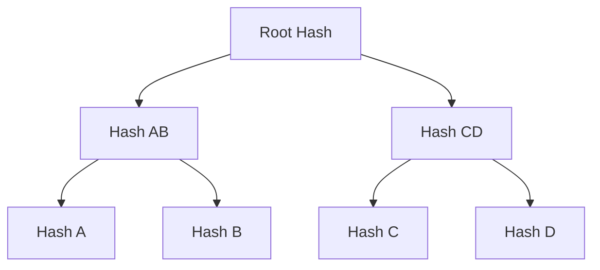

# Concepts

This page explains the key concepts behind MTS and its two trie implementations.

## Merkle Trees

A Merkle tree is a tree where:

- Each leaf node contains the hash of a data block
- Each internal node contains the hash of its children



This structure enables **Merkle proofs** - compact proofs that a specific piece of data is part of the tree. To prove inclusion of data A, you only need:

1. Hash of A
2. Hash B (sibling)
3. Hash CD (uncle)

With these three hashes, anyone can recompute the root and verify the proof.

## MTS: The Shared Interface

MTS defines a common `MerkleTreeStore` record that abstracts over the trie
implementation. Type families determine the concrete key, value, hash, proof,
leaf, and completeness proof types for each backend:

| Operation | Type |
|-----------|------|
| `mtsInsert` | `MtsKey imp -> MtsValue imp -> m ()` |
| `mtsDelete` | `MtsKey imp -> m ()` |
| `mtsRootHash` | `m (Maybe (MtsHash imp))` |
| `mtsMkProof` | `MtsKey imp -> m (Maybe (MtsProof imp))` |
| `mtsVerifyProof` | `MtsValue imp -> MtsProof imp -> m Bool` |
| `mtsBatchInsert` | `[(MtsKey imp, MtsValue imp)] -> m ()` |

Application code written against `MerkleTreeStore imp m` works with either
CSMT or MPF. See [MTS Interface](interface.md) for the full API.

## Sparse Merkle Trees

A Sparse Merkle Tree (SMT) is a Merkle tree where:

- Keys determine the path through the tree (each bit = left or right)
- Most leaves are empty (hence "sparse")
- The tree depth equals the key length in bits

For a 256-bit key, a naive SMT would have 2^256 possible leaves - far too large to store explicitly.

## CSMT: Compact Sparse Merkle Tree

The CSMT is a **binary trie** that optimizes storage through path compression:

1. **Path compression**: Empty subtrees are not stored
2. **Jump paths**: Instead of storing each node on the path, we store a "jump" directly to where the data diverges

### Path Compression Example

Consider inserting keys `LLRR` and `LRRL`:

**Without compression** (naive SMT):
```
Root -> L -> L -> R -> R -> value1
     -> R -> R -> L -> value2
```

**With compression** (CSMT):
```
Root -> L (jump to divergence point)
       +-- L,RR -> value1  (jump = RR)
       +-- R,RL -> value2  (jump = RL)
```

The CSMT stores only the nodes where paths actually diverge, plus "jump" metadata indicating how many levels to skip.

### CSMT Key Components

**Keys**: Sequences of directions (`L` = left = 0, `R` = right = 1). A 256-bit hash becomes a 256-element path.

**Indirect references**: Each node stores an `Indirect` value containing a `jump` (path prefix to skip) and a `value` (hash).

**Hashing**: Blake2b-256. Internal node hashes are computed by hashing the serialized left and right children.

For CSMT-specific details, see [CSMT (Binary Trie)](csmt.md).

## MPF: Merkle Patricia Forest

The MPF is a **16-ary trie** where each node branches on a hex nibble (4 bits)
rather than a single bit. This gives a much shallower tree for the same key
length: a 32-byte key produces a trie of depth 64 (nibbles) rather than 256
(bits).

### Hex Nibble Keys

Keys are represented as sequences of `HexDigit` values (0-15). A
`ByteString` key is converted to a `HexKey` by splitting each byte into its
high and low nibbles:

```
byte 0xa3 -> [HexDigit 0xa, HexDigit 0x3]
```

### 16-ary Branching

Each branch node holds a sparse 16-element array of children (one per
nibble). Path compression works similarly to CSMT: a `hexJump` field on
each `HexIndirect` node records the key suffix to skip.

Nodes are tagged as **leaf** (`hexIsLeaf = True`) or **branch**
(`hexIsLeaf = False`), which determines the hashing scheme.

### MPF Hashing

MPF uses a different hash construction from CSMT to achieve Aiken
compatibility:

- **Leaf hash**: `blake2b(hashHead || hashTail || valueDigest)` where
  `hashHead`/`hashTail` encode the suffix nibbles with even/odd length
  handling
- **Branch hash**: `blake2b(nibbleBytes(prefix) || merkleRoot(children))`
  where `merkleRoot` reduces the 16-slot sparse array via pairwise hashing
- **Merkle root**: Pairwise reduction of 16 child hashes (missing children
  use a null hash of 32 zero bytes)

For MPF-specific details, see [MPF (16-ary Trie)](mpf.md).

## Proofs

### Inclusion Proofs

An inclusion proof demonstrates that a key-value pair exists in the tree.
Both CSMT and MPF support inclusion proofs through the shared
`mtsMkProof`/`mtsVerifyProof` interface, though the internal proof
format differs.

**CSMT proofs** are CBOR-encoded and contain the key, value hash, root hash,
sibling hashes along the path, and jump paths at each level. See
[Inclusion Proof Format](architecture/inclusion-proof.md) for the wire
format specification.

**MPF proofs** contain the key, value, a sequence of proof steps (each with
a node type tag, sibling hash, and SMT proof hashes), and the root hash.

### Completeness Proofs

A completeness proof demonstrates that a set of values comprises the
entire contents of a subtree. When `treePrefix` groups entries by a
common prefix (e.g. address bytes), a completeness proof can show that
a given set of entries is **all** entries under that prefix. It consists of:

1. All leaf values under the prefix
2. A sequence of merge operations to reconstruct the subtree
3. Sibling hashes at the boundary to connect back to the root

Completeness proofs are currently implemented for CSMT only. MPF
completeness proofs are planned.

## Storage Model

Both implementations use a three-column storage model:

| Column | Key | Value | Purpose |
|--------|-----|-------|---------|
| KV | User key | User value | Original key-value pairs |
| Trie | Derived tree key | Node (jump + hash) | Merkle tree structure |
| Journal | User key | Tagged value | KVOnly replay log |

The tree key is derived from the user key (and optionally a prefix from
the value) using the `FromKV`/`FromHexKV` conversion records. The Journal
column records mutations made in KVOnly mode for later replay against the
tree.

See [Storage Layer](architecture/storage.md) for implementation-specific
details.

## Operational Modes

MTS operates in one of two modes, enforced at the type level by the
`Mode` kind and the `Ops` GADT:

- **KVOnly** — mutations write to the KV and Journal columns only.
  No tree operations are available (no root hash, no proofs). This is
  the fast-ingest mode.
- **Full** — mutations write to KV and update the CSMT/MPF tree.
  Root hash, inclusion proofs, and completeness proofs are available.

The mode is not observable from the database alone; it is tracked by
the `Ops` GADT in memory.

## Lifecycle and Transition

The `Ops` GADT provides bidirectional transitions:

- **`toFull`** (KVOnly → Full): replays journal entries against the tree
  via `patchParallel` with concurrent bucket execution, then returns
  `OpsFull`.
- **`toKVOnly`** (Full → KVOnly): verifies the journal is empty, then
  returns `OpsKVOnly`.

The `MtsTransition` record provides a managed lifecycle with a one-shot
`transitionToFull` action that locks the KVOnly store before replaying.

## Crash Safety

Each bucket transaction in the parallel replay is atomic (tree ops +
journal entry deletes in a single transaction). A **sentinel flag** in
the journal column brackets the non-atomic `toFull` sequence:

1. Write sentinel (bucket bits + prefix)
2. `expandToBucketDepth`
3. Replay loop (parallel bucket transactions)
4. `mergeSubtreeRoots` + delete sentinel (atomic)

If the process crashes between steps 1–4, the next `toFull` detects the
sentinel, runs `mergeSubtreeRoots` to fix the tree top, then continues
with the normal replay of remaining journal entries.

The `DbState` type exposes this as a three-state open result:

- `NeedsRecovery` — sentinel found, must run recovery first
- `Ready` — clean state, choose KVOnly or Full

## Rollbacks

The `rollbacks` library implements a swap-partition model where two
database partitions alternate between "live" and "staging" roles.
Rollbacks discard the staging partition and swap back. Formal
correctness is proved in Lean 4 (see `lean/` directory).
