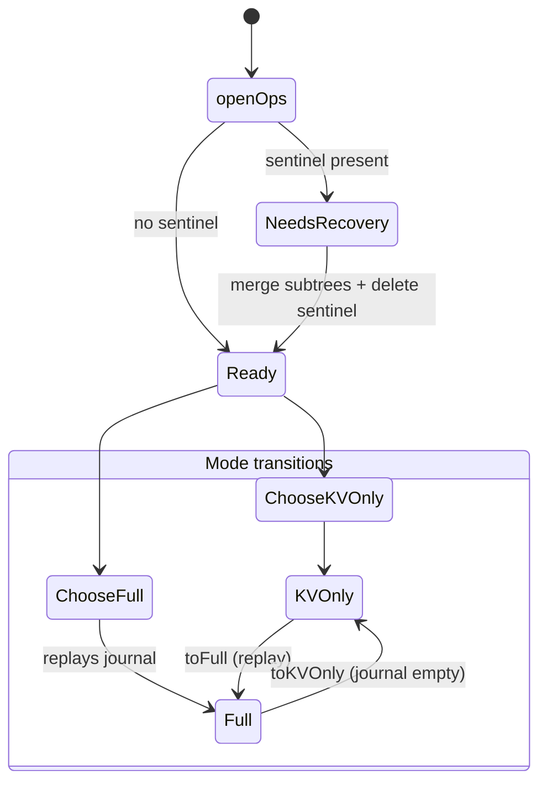
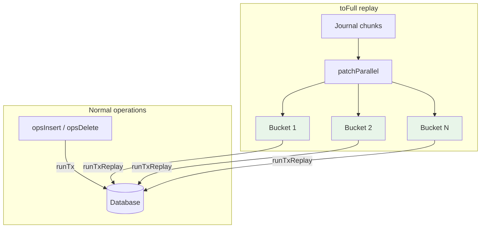

# Library API

This page covers using the MTS library in Haskell applications. There are
three levels of API:

1. **MTS Interface** (recommended) - Implementation-agnostic
2. **CSMT Direct API** - CSMT-specific operations
3. **MPF Direct API** - MPF-specific operations

## 1. MTS Interface API (Recommended)

The `MerkleTreeStore` record provides a uniform API for both
implementations. See [MTS Interface](interface.md) for the full type
definition.

### Basic Usage

```haskell
import MTS.Interface (MerkleTreeStore(..))

example :: MerkleTreeStore imp IO -> IO ()
example store = do
    -- Insert
    mtsInsert store "key1" "value1"
    mtsInsert store "key2" "value2"

    -- Root hash
    mroot <- mtsRootHash store
    print mroot

    -- Inclusion proof
    mp <- mtsMkProof store "key1"
    case mp of
        Nothing -> putStrLn "Key not found"
        Just proof -> do
            ok <- mtsVerifyProof store "value1" proof
            print ok  -- True

    -- Batch insert
    mtsBatchInsert store [("key3", "value3"), ("key4", "value4")]

    -- Delete
    mtsDelete store "key1"
```

### Constructing Stores

See [MTS Interface](interface.md#constructors) for `csmtMerkleTreeStore`
and `mpfMerkleTreeStore` constructor signatures and examples.

## 2. CSMT Direct API

For CSMT-specific features (completeness proofs, CBOR proof format, CLI
integration), use the `mts:csmt` sub-library directly.

### Modules

| Module | Purpose |
|--------|---------|
| `CSMT` | Re-exports the public API |
| `CSMT.Hashes` | Blake2b-256 operations, `fromKVHashes`, `hashHashing` |
| `CSMT.Interface` | `FromKV`, `Hashing`, `Indirect`, `root` |
| `CSMT.Insertion` | `inserting`, `expandToBucketDepth`, `mergeSubtreeRoots` |
| `CSMT.Deletion` | `deleting` |
| `CSMT.Populate` | `patchParallel`, `PatchOp` — bucketed parallel replay |
| `CSMT.Proof.Insertion` | `buildInclusionProof`, `verifyInclusionProof`, `computeRootHash` |
| `CSMT.Proof.Completeness` | `generateProof`, `collectValues`, `foldProof` |
| `CSMT.Backend.RocksDB` | RocksDB persistent backend |
| `CSMT.Backend.Pure` | In-memory backend for testing |
| `CSMT.Backend.Standalone` | Column selectors and codecs |
| `CSMT.MTS` | `CsmtImpl`, `Ops` GADT, `CommonOps`, `DbState`, `csmtMerkleTreeStore` |

### Insert and Delete

```haskell
import CSMT.Hashes (fromKVHashes)
import CSMT.Insertion (inserting)
import CSMT.Deletion (deleting)

-- In a transaction context:
inserting fromKVHashes hashing StandaloneKVCol StandaloneCSMTCol "key" "value"
deleting  fromKVHashes hashing StandaloneKVCol StandaloneCSMTCol "key"
```

### Inclusion Proofs

```haskell
import CSMT.Proof.Insertion (buildInclusionProof, verifyInclusionProof)

-- Generate (in transaction)
result <- buildInclusionProof fromKVHashes StandaloneKVCol StandaloneCSMTCol "key"
-- result :: Maybe (ByteString, InclusionProof Hash)

-- Verify (pure, requires trusted root hash)
verifyInclusionProof hashing trustedRootHash proof  -- :: Bool
```

### Completeness Proofs

```haskell
import CSMT.Proof.Completeness (generateProof, collectValues, foldProof)

-- Collect leaves under a prefix
leaves <- collectValues StandaloneCSMTCol prefix

-- Generate proof
mproof <- generateProof StandaloneCSMTCol prefix

-- Verify
let computed = foldProof (combineHash hashing) leaves proof
```

### Custom Key/Value Types

```haskell
import CSMT.Interface (FromKV(..))

myFromKV :: FromKV MyKey MyValue Hash
myFromKV = FromKV
    { fromK      = myKeyToPath
    , fromV      = myValueToHash
    , treePrefix = const []
    }
```

The `treePrefix` field enables secondary indexing by prepending a prefix
derived from the value to the tree key.

### Column Selectors

CSMT uses type-safe GADT column selectors:

- `StandaloneKVCol` - Key-value column
- `StandaloneCSMTCol` - CSMT tree column
- `StandaloneJournalCol` - Journal column (KVOnly replay)

### KVOnly Mode

For high-throughput ingest without tree overhead, use KVOnly mode
via the `Ops` GADT:

```haskell
import CSMT.MTS (mkKVOnlyOps, Ops(..), CommonOps(..))

-- Build KVOnly ops
let ops = mkKVOnlyOps prefix bucketBits chunkSize
            kvCol csmtCol journalCol journalIso
            fromKV hashing runTx runTxReplay trace

-- Insert (writes KV + journal, no tree)
runTx $ opsInsert (kvCommon ops) key value

-- Transition to Full (replays journal via patchParallel)
Just fullOps <- toFull ops
rootHash <- runTx $ opsRootHash fullOps
```

### Crash Recovery

`openOps` checks for a sentinel flag left by a crashed `toFull`
transition and returns a `DbState` value:



If the process crashes mid-`toFull` (after the sentinel is
written but before merge completes), the next `openOps` call
detects the sentinel, runs `mergeSubtreeRoots`, and returns
a clean `Ready` state.

### Transaction Runners

`mkKVOnlyOps` and `openOps` take two transaction runners:

- **`runTx`** — guarded (e.g. MVar-locked), used for normal
  insert/delete operations where concurrent block processing
  requires serialization.
- **`runTxReplay`** — unguarded, used exclusively during the
  `toFull` journal replay where `patchParallel` splits work
  into independent bucket transactions.



Bucket transactions are safe to run without a lock because
`patchParallel` partitions operations by tree key prefix —
each bucket writes to a disjoint subtree, so there are no
data races.

### Parallel Replay

The `toFull` transition replays journal entries using
`patchParallel`, which splits operations by tree key prefix
into independent bucket transactions that run concurrently.
See [CSMT](csmt.md#parallel-population-patchparallel) for
benchmarks.

## 3. MPF Direct API

For MPF-specific features (batch/streaming inserts, hex key manipulation),
use the `mts:mpf` sub-library directly.

### Modules

| Module | Purpose |
|--------|---------|
| `MPF` | Re-exports the public API |
| `MPF.Hashes` | Blake2b-256 operations, `fromHexKVHashes`, `fromHexKVAikenHashes`, `mpfHashing` |
| `MPF.Hashes.Aiken` | Aiken proof-step rendering/parsing helpers |
| `MPF.Interface` | `FromHexKV`, `HexIndirect`, `HexKey`, `HexDigit` |
| `MPF.Insertion` | `inserting`, `insertingBatch`, `insertingChunked`, `insertingStream` |
| `MPF.Deletion` | `deleting` |
| `MPF.Proof.Insertion` | `mkMPFInclusionProof`, `verifyMPFInclusionProof`, `foldMPFProof` |
| `MPF.Proof.Exclusion` | `mkMPFExclusionProof`, `verifyMPFExclusionProof`, `foldMPFExclusionProof` |
| `MPF.Verify` | `verifyAikenInclusionProof`, `verifyAikenExclusionProof` |
| `MPF.Backend.RocksDB` | RocksDB persistent backend |
| `MPF.Backend.Pure` | In-memory backend for testing |
| `MPF.Backend.Standalone` | Column selectors and codecs |
| `MPF.MTS` | `MpfImpl`, `mpfMerkleTreeStore` |

### Insert Modes

```haskell
import MPF.Insertion (inserting, insertingBatch, insertingChunked, insertingStream)

-- Sequential (small datasets)
inserting fromKV hashing kvCol mpfCol key value

-- Batch (medium datasets, O(n log n))
insertingBatch fromKV hashing kvCol mpfCol [(k1, v1), (k2, v2)]

-- Chunked (large datasets, bounded memory)
insertingChunked fromKV hashing kvCol mpfCol chunkSize pairs

-- Streaming (very large datasets, ~16x lower peak memory)
insertingStream fromKV hashing kvCol mpfCol pairs
```

### Hex Key Operations

```haskell
import MPF.Hashes (aikenKeyPath, fromHexKVAikenHashes)
import MPF.Interface (byteStringToHexKey, hexKeyToByteString, HexDigit(..), HexKey)

let key = byteStringToHexKey "hello"  -- [HexDigit 6, HexDigit 8, ...]
let bs  = hexKeyToByteString key       -- round-trips back
let aiken = aikenKeyPath "hello"       -- Blake2b(key) rendered as nibbles
```

Use `fromHexKVAikenHashes` when you need the same hashed key routing used by
the Aiken-compatible browser demo and `MPF.Verify`. Keep `fromHexKVHashes`
for direct raw-byte-to-nibble routing.

### Column Selectors

MPF uses its own GADT column selectors:

- `MPFStandaloneKVCol` - Key-value column
- `MPFStandaloneMPFCol` - MPF tree column

### Aiken Proof Verification

For browser/WASM-style verification against raw key/value bytes:

```haskell
import MPF.Verify
    ( verifyAikenExclusionProof
    , verifyAikenInclusionProof
    )
```

These functions verify the exact proof-step bytes emitted by
`renderAikenProof`, which is the transport used by the MPF browser demo.

## Error Handling

- `Nothing` from proof/root operations means "key not found" or "tree empty"
- Invalid proofs return `False` from verification
- Database errors surface as exceptions
- MPF completeness proof operations currently `fail`

## Performance Tips

1. **Use the MTS interface** when you don't need implementation-specific features
2. **Batch inserts** for MPF are significantly faster than sequential for large datasets
3. **Streaming inserts** reduce peak memory by ~16x by processing subtrees independently
4. **Group transactions** to amortize RocksDB write overhead
