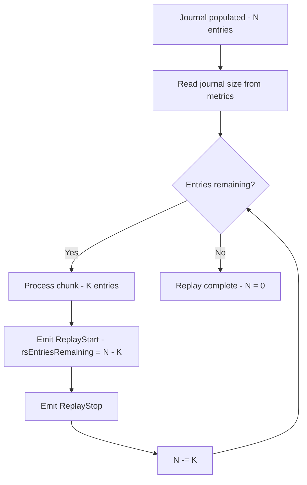

# Data Model: Replay Tracing

## Entities

### ReplayEvent (extended)

Notification emitted during journal replay. Extended with
entries-remaining count.

**Fields**:
- `ReplayStart`:
  - `rsChunkSize :: Int` — entries in this chunk (existing)
  - `rsBuckets :: Int` — active bucket count (existing)
  - `rsTotalBuckets :: Int` — total buckets (existing)
  - `rsOpsPerBucket :: [Int]` — ops per active bucket (existing)
  - `rsEntriesRemaining :: Int` — journal entries left after this chunk (new)
- `ReplayStop` — no fields (existing, unchanged)

**Invariants**:
- `rsEntriesRemaining` starts at total journal size
- Decreases monotonically across successive `ReplayStart` events
- Reaches 0 on the final chunk

### Trace Callback

Consumer-provided function: `ReplayEvent -> IO ()`

**Usage pattern**: Passed as a parameter to replay functions. Callers
who don't need tracing pass `const (pure ())`.

## State Transitions

